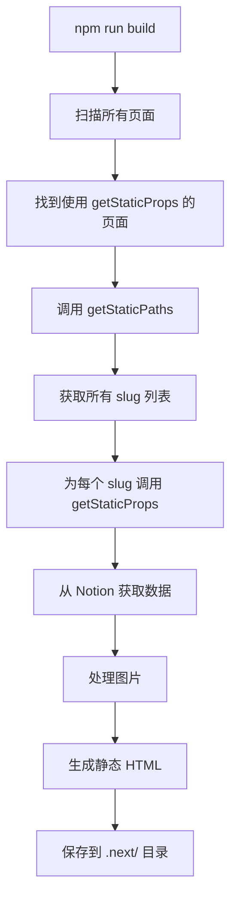
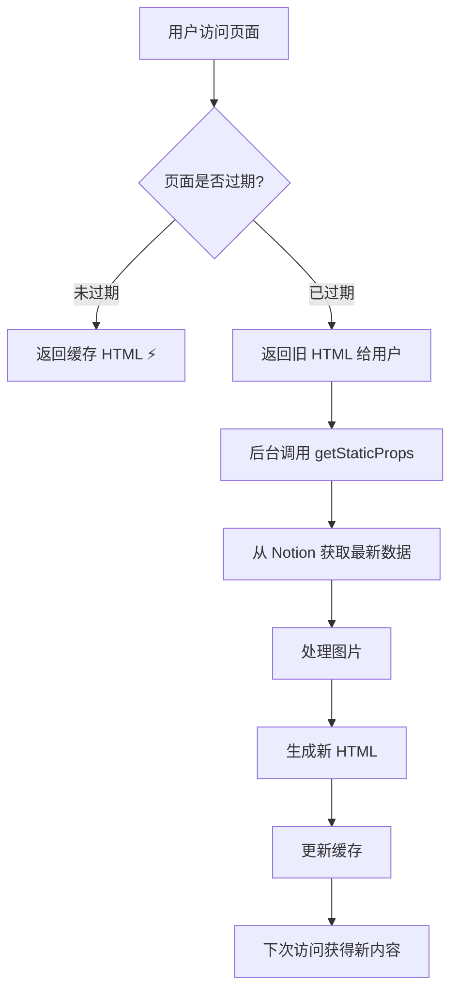

# Next.js getStaticProps 调用时机详解

## 🎯 核心概念

`getStaticProps` 是 Next.js 用于**静态站点生成（SSG）**和**增量静态再生成（ISR）**的函数。

---

## ⏰ 调用时机

### 1️⃣ 构建时（Build Time）

**何时**: 当你运行 `npm run build` 时

```bash
npm run build
```

**发生的事情**:
```
1. Next.js 扫描所有页面
2. 对于每个使用了 getStaticProps 的页面
3. 调用 getStaticProps 获取数据
4. 生成静态 HTML 文件
5. 保存到 .next/ 目录
```

**在你的项目中**:

```typescript:165:275:pages/blog/[slug].tsx
export const getStaticProps: GetStaticProps = async ({ params }) => {
  // res.setHeader('Cache-Control', 'max-age=0, s-maxage=60, stale-while-revalidate')
  const { slug } = params as Props

  const db = await getDatabase(slug)
  const post = db[0].id

  const page = await getPage(post)
  const { last_edited_time } = (page as any)

  // if json props exists, and the last_edited time is the same, return the old one.
  if (fs.existsSync(`${process.cwd()}/.next/server/pages/${slug}.json`)) {
    const oldProps = JSON.parse(fs.readFileSync(`${process.cwd()}/.next/server/pages/${slug}.json`, 'utf8'))
    if (oldProps.page.last_edited_time === last_edited_time) {
      console.log(` ${slug} has not been modified since last build. Skipping revalidation.`)
      return {
        props: oldProps,
        revalidate: 60,
      }
    }
  }
  // const blocks = await getBlocks(post)

  const imageBlocks: any[] = []

  const recursiveGetBlocks = async (blocks: any[]) => {
    return await Promise.all(
      blocks
        .map(async (b: any) => {
          if (b.type === 'image') { imageBlocks.push(b) }
          if (b.has_children) {
            let children = await getBlocks(b.id)
            children = await recursiveGetBlocks(children)
            b[b.type]['children'] = children
          }
          return b
        })
    )
  }

  let blocks = await getBlocks(post)
  blocks = await recursiveGetBlocks(blocks)

  // 创建临时目录
  const tempDir = IMAGE_TEMP_PATH
  if (!fs.existsSync(tempDir)) {
    fs.mkdirSync(tempDir, { recursive: true })
  }

  // Resolve all images' dimensions
  await Promise.all(
    // blocksWithChildren
    imageBlocks
      .filter((b: any) => b.type === 'image')
      .map(async (b) => {
        const { type } = b
        const value = b[type]
        let src = value.type === 'external' ? value.external.url : value.file.url
        const imgHashName = await imageFileName(src)
        
        // 检查图片是否已经处理并上传到 COS
        const isProcessed = await isImageProcessed(imgHashName)
        
        if (!isProcessed) {
          // 图片未处理，需要下载、生成缩略图并上传
          console.log(`[INFO] Processing new image: ${imgHashName}`)
          
          try {
            // 1. 下载原图到临时目录
            const localPath = `${tempDir}/${imgHashName}`
            await downloadImage(src, tempDir, imgHashName)
            
            // 2. 生成缩略图并上传到 COS
            await processAndUploadImage(localPath, imgHashName)
            console.log(`[INFO] Successfully processed: ${imgHashName}`)
            
            // 使用 COS CDN URL
            value[value.type].url = imageCDNUrl(imgHashName)
          } catch (err) {
            console.error(`[ERROR] Failed to download or process image: ${imgHashName}`, err)
            console.warn(`[WARN] Falling back to original Notion URL for: ${imgHashName}`)
            // 如果下载或处理失败，使用原始 Notion URL
            value[value.type].url = src
          }
        } else {
          console.log(`[INFO] Image already processed: ${imgHashName}`)
          // 使用 COS CDN URL
          value[value.type].url = imageCDNUrl(imgHashName)
        }
        
        // 获取图片尺寸（无论使用哪个 URL）
        try {
          const { width, height } = await probeImageSize(src)
          value['dim'] = { width, height }
        } catch (err) {
          console.error(`[ERROR] Failed to probe image size: ${imgHashName}`, err)
          // 如果无法获取尺寸，使用默认值
          value['dim'] = { width: 800, height: 600 }
        }
        
        b[type] = value
      })
  )

  // 清理临时目录（如果存在且为空）
  try {
    const files = await fs.promises.readdir(tempDir)
    if (files.length === 0) {
      await fs.promises.rmdir(tempDir)
    }
  } catch (err) {
    // 忽略清理错误
  }

  // return { props: { page, blocks: blocksWithChildren }, revalidate: 1 } // 1 hour
  return { props: { page, blocks: blocks } }
}
```

**这个函数会在构建时执行**，为每篇博客文章：
1. 从 Notion 获取内容
2. 处理图片（下载、生成缩略图、上传）
3. 生成静态 HTML
4. 保存到磁盘

---

### 2️⃣ 增量静态再生成（ISR - Revalidate）

**何时**: 在用户访问页面时，如果页面已过期

```typescript
return {
  props: { page, blocks },
  revalidate: 60, // 60 秒后页面过期
}
```

**工作流程**:
```
用户访问页面 → Next.js 检查页面是否过期
  ├─ 未过期 → 返回缓存的 HTML ⚡
  └─ 已过期 → 后台重新运行 getStaticProps → 生成新 HTML
```

**特点**:
- ✅ 首次访问立即返回旧页面（不阻塞）
- ✅ 后台异步更新
- ✅ 下次访问获得新内容

**在你的项目中**:

```typescript:151:159:pages/blog/[slug].tsx
export const getStaticPaths = async () => {
  const db = await getDatabase()
  return {
    paths: db.map((p: any) => ({
      params: { slug: p.properties.slug.results[0].rich_text.plain_text },
    })),
    fallback: 'blocking',
  }
}
```

---

### 3️⃣ 手动触发（On-demand Revalidation）

**何时**: 通过 API 路由手动触发

可能在 `pages/api/revalidate.ts` 中有类似代码：

```typescript
// 手动重新生成特定页面
await res.revalidate('/blog/my-post')
```

**使用场景**:
- 在 Notion 中更新文章后
- 通过 Webhook 触发
- 手动刷新页面

---

## 🔄 完整生命周期

### 首次构建



**时间**: 构建时执行一次

### 运行时（ISR）



**时间**: 页面过期后首次访问时

---

## 📊 你的项目配置

### 博客文章页面

```typescript
export const getStaticProps: GetStaticProps = async ({ params }) => {
  // ... 处理逻辑 ...
  
  return { 
    props: { page, blocks },
    // 没有设置 revalidate，表示永不过期
    // 只在构建时生成一次
  }
}
```

**特点**:
- ✅ 完全静态
- ✅ 构建时生成
- ✅ 不会自动更新
- ✅ 需要手动重新构建

### 博客列表页面

```typescript:132:138:pages/blog.tsx
export const getStaticProps: GetStaticProps = async () => {
  const db = await getDatabase()
  return {
    props: { posts: db },
    revalidate: 10, // 10 minutes
  }
}
```

**特点**:
- ✅ 每 10 分钟自动更新
- ✅ ISR 模式

### 首页

```typescript:125:133:pages/index.tsx
export const getStaticProps: GetStaticProps = async () => {
  const latestPost = await getLatestPostProps()
  const latestPrivatePost = await getLatestPostProps(true)

  return {
    props: { latestPost, latestPrivatePost },
    revalidate: 60 * 10, // 10 minutes
  }
}
```

**特点**:
- ✅ 每 10 分钟自动更新
- ✅ ISR 模式

---

## 🕐 调用频率总结

### 开发模式 (`npm run dev`)

- **每次刷新页面都会调用** `getStaticProps`
- 方便开发和调试
- 可以立即看到 Notion 的最新内容

### 生产模式 (`npm run build && npm start`)

| 页面 | 调用时机 | 频率 |
|------|----------|------|
| `/blog/[slug]` | 构建时 | 仅一次 |
| `/blog` | 构建时 + ISR | 每 10 分钟 |
| `/` | 构建时 + ISR | 每 10 分钟 |
| `/publication` | 构建时 + ISR | 每 24 小时 |

---

## 💡 为什么图片在构建时处理？

### 原因分析

```typescript
// getStaticProps 在构建时执行
export const getStaticProps: GetStaticProps = async ({ params }) => {
  // 1. 获取 Notion 内容
  const blocks = await getBlocks(post)
  
  // 2. 处理图片（在构建时）
  await Promise.all(
    imageBlocks.map(async (b) => {
      await downloadImage(...)      // 构建时下载
      await processAndUploadImage(...) // 构建时上传
    })
  )
  
  // 3. 返回处理后的数据
  return { props: { page, blocks } }
}
```

**优势**:
- ✅ 图片处理不影响用户访问速度
- ✅ 所有工作在构建时完成
- ✅ 用户访问时只需加载静态 HTML
- ✅ CDN URL 在构建时确定

**流程**:
```
构建时:
  getStaticProps 执行 → 处理图片 → 生成 HTML → 保存到磁盘

用户访问时:
  直接返回静态 HTML → 浏览器加载图片（从 COS CDN）
```

---

## 🔄 ISR（增量静态再生成）详解

### 什么是 ISR？

ISR 允许你在不重新构建整个网站的情况下更新静态页面。

### 示例配置

```typescript
export const getStaticProps: GetStaticProps = async () => {
  const data = await fetchData()
  
  return {
    props: { data },
    revalidate: 60, // 60 秒后页面标记为过期
  }
}
```

### ISR 工作流程

```
时间轴:
00:00 - 构建完成，生成页面 A
00:30 - 用户访问 → 返回页面 A（新鲜）
01:05 - 用户访问 → 返回页面 A（已过期，但仍返回）
                  → 后台重新调用 getStaticProps
                  → 生成新页面 B
01:10 - 用户访问 → 返回页面 B（更新后）
```

**特点**:
1. **用户永远不会等待** - 即使页面过期也立即返回
2. **后台更新** - 不阻塞用户请求
3. **逐步更新** - 只更新被访问的页面
4. **节省资源** - 不需要重新构建整个网站

---

## 🏗️ 你的项目中的应用

### 场景 1: 发布新博客

```
1. 在 Notion 中写新文章
2. 运行 npm run build
   ├─ getStaticPaths 获取所有文章 slug
   ├─ 为每个 slug 调用 getStaticProps
   │  ├─ 下载 Notion 内容
   │  ├─ 处理图片（下载、缩略图、上传 COS）
   │  └─ 生成 HTML
   └─ 部署到服务器
3. 用户访问时直接返回预生成的 HTML
```

### 场景 2: 更新现有博客

#### 方案 A: 重新构建（当前）

```bash
npm run build
# 重新生成所有页面
```

#### 方案 B: ISR 自动更新（需要配置）

```typescript
return {
  props: { page, blocks },
  revalidate: 60 * 60, // 1 小时后过期
}
```

然后：
```
1. 在 Notion 中更新文章
2. 等待 1 小时（或有人访问该页面）
3. Next.js 自动重新生成页面
4. 无需手动构建
```

#### 方案 C: 手动触发（推荐）

创建 API 路由：

```typescript
// pages/api/revalidate.ts
export default async function handler(req, res) {
  const { slug, secret } = req.query
  
  // 验证密钥
  if (secret !== process.env.REVALIDATE_SECRET) {
    return res.status(401).json({ message: 'Invalid token' })
  }
  
  try {
    // 重新生成特定页面
    await res.revalidate(`/blog/${slug}`)
    return res.json({ revalidated: true })
  } catch (err) {
    return res.status(500).json({ message: 'Error revalidating' })
  }
}
```

使用：
```bash
curl "https://yourdomain.com/api/revalidate?slug=my-post&secret=xxx"
```

---

## ⚙️ getStaticPaths 的作用

### 动态路由的预渲染

```typescript:151:159:pages/blog/[slug].tsx
export const getStaticPaths = async () => {
  const db = await getDatabase()
  return {
    paths: db.map((p: any) => ({
      params: { slug: p.properties.slug.results[0].rich_text.plain_text },
    })),
    fallback: 'blocking',
  }
}
```

**作用**:
1. 告诉 Next.js 需要生成哪些页面
2. 返回所有可能的 `[slug]` 值

**执行流程**:
```
npm run build 时:
1. 调用 getStaticPaths → 返回 ['post-1', 'post-2', 'post-3']
2. 为每个 slug 调用 getStaticProps:
   ├─ getStaticProps({ params: { slug: 'post-1' } })
   ├─ getStaticProps({ params: { slug: 'post-2' } })
   └─ getStaticProps({ params: { slug: 'post-3' } })
3. 生成 3 个静态页面
```

---

## 🔍 fallback 模式

```typescript
fallback: 'blocking'
```

### 三种模式

| 模式 | 行为 | 使用场景 |
|------|------|----------|
| `false` | 404（未预生成的路径） | 固定页面数量 |
| `true` | 返回 fallback 页面 → 生成 → 显示 | 大量页面 |
| `'blocking'` | 服务端生成 → 返回完整页面 | 需要完整 SEO |

**你的项目使用 `'blocking'`**:
- ✅ 新文章首次访问时会在服务端生成
- ✅ 不显示 loading 状态
- ✅ 对 SEO 友好
- ✅ 生成后会缓存

---

## 🚀 性能优化

### 当前实现的优化

#### 1. 缓存检查

```typescript
if (fs.existsSync(`${process.cwd()}/.next/server/pages/${slug}.json`)) {
  const oldProps = JSON.parse(...)
  if (oldProps.page.last_edited_time === last_edited_time) {
    console.log('Skipping revalidation.')
    return { props: oldProps, revalidate: 60 }
  }
}
```

**作用**: 如果文章没有修改，跳过处理，使用缓存的数据。

#### 2. 并行处理

```typescript
await Promise.all(
  imageBlocks.map(async (b) => {
    // 并行处理所有图片
  })
)
```

**作用**: 同时处理多张图片，加快构建速度。

---

## 📊 时间对比

### 开发模式 vs 生产模式

| 操作 | 开发模式 (`npm run dev`) | 生产模式 (`npm start`) |
|------|-------------------------|----------------------|
| **getStaticProps 执行** | 每次刷新页面 | 仅构建时 |
| **图片处理** | 每次刷新 | 仅构建时 |
| **页面响应速度** | 慢（需等待数据获取） | 快（直接返回 HTML）|
| **适用场景** | 开发调试 | 生产部署 |

### 构建时间估算

假设你有 10 篇博客文章，每篇 5 张图片：

```
getStaticPaths: ~2 秒（获取文章列表）
  ├─ 文章 1: getStaticProps ~15 秒（5 张新图片）
  ├─ 文章 2: getStaticProps ~5 秒（已处理的图片）
  ├─ 文章 3: getStaticProps ~15 秒（5 张新图片）
  ├─ ...
  └─ 文章 10: getStaticProps ~5 秒

总计: ~100-150 秒（首次构建）
      ~30-50 秒（增量构建，大部分图片已处理）
```

---

## 🎯 最佳实践

### 1. 适当使用 revalidate

```typescript
// 静态内容（很少更新）
return { props, revalidate: 86400 } // 24 小时

// 动态内容（经常更新）
return { props, revalidate: 60 } // 1 分钟

// 完全静态（从不更新）
return { props } // 无 revalidate
```

### 2. 使用条件处理

```typescript
// 检查是否需要重新处理
if (oldProps.last_edited_time === new_last_edited_time) {
  return { props: oldProps } // 跳过处理
}
```

### 3. 错误处理

```typescript
try {
  await processImage(...)
} catch (err) {
  // 降级处理，不中断构建
  useOriginalUrl()
}
```

---

## 📖 相关文档

- [Next.js getStaticProps 官方文档](https://nextjs.org/docs/basic-features/data-fetching/get-static-props)
- [ISR 详解](https://nextjs.org/docs/basic-features/data-fetching/incremental-static-regeneration)
- [getStaticPaths 文档](https://nextjs.org/docs/basic-features/data-fetching/get-static-paths)

---

## 🎉 总结

### getStaticProps 调用时机

1. **构建时** (`npm run build`) - 必然调用 ✅
2. **ISR 更新时** (配置了 `revalidate` 且页面过期) - 按需调用 🔄
3. **手动触发** (通过 API 路由) - 手动调用 🔧
4. **开发模式** (`npm run dev`) - 每次刷新 🛠️

### 关键特点

- ⚡ **在服务端执行**，不在浏览器
- 🔐 **可以访问文件系统、数据库、API**
- 📦 **生成静态 HTML**，超快访问速度
- 🔄 **支持 ISR**，实现准实时更新
- 🎯 **构建时处理图片**，运行时无压力

**在你的项目中，图片处理都在构建时的 `getStaticProps` 中完成！** 🚀

